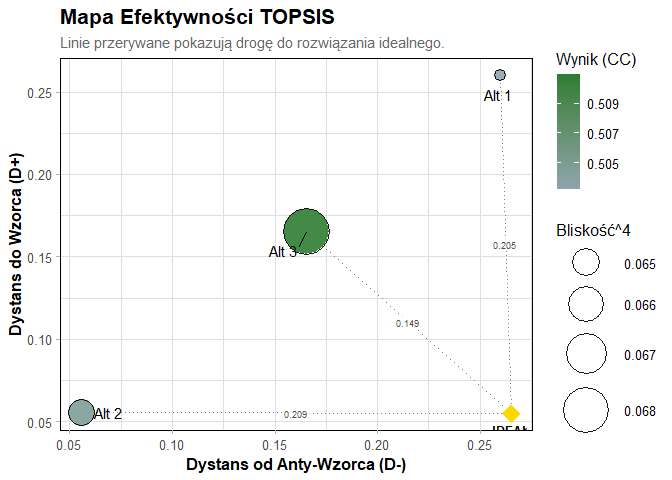

CyberRankR
================

# CyberRankR

Pakiet **CyberRankR** to kompleksowe narzędzie do wielokryterialnej
analizy decyzyjnej (MCDA) w środowisku rozmytym. Umożliwia pełną ścieżkę
analityczną: od surowych danych, przez wyznaczanie wag metodą **BWM
(Best–Worst Method)** lub **entropii Shannona**, aż po rankingi metodami
**TOPSIS, VIKOR, WASPAS** oraz meta-ranking konsensusowy.

------------------------------------------------------------------------

## Instalacja

Wersja deweloperska z GitHuba:

``` r
install.packages("devtools")
devtools::install_github("BeatryczePilat/CyberRankR")
```

------------------------------------------------------------------------

## Podstawowy przykład użycia

### 1. Załaduj pakiet i dane

``` r
library(CyberRankR)
data(cyber_expert_panel)
```

------------------------------------------------------------------------

### 2. Przygotuj rozmytą macierz decyzyjną

``` r
macierz <- przygotuj_dane_mcda(
  dane = cyber_expert_panel,
  skladnia = "
    severity     =~ severity;
    malware      =~ malware;
    anomaly      =~ anomaly;
    packet_load  =~ packet_load;
    penetration  =~ penetration;
    security_det =~ security_det;
    asset_crit   =~ asset_crit;
    geo_risk     =~ geo_risk
  ",
  kolumna_alternatyw = "Alternative"
)
```

------------------------------------------------------------------------

### 3. Ranking Fuzzy TOPSIS (wagi z entropii Shannona)

``` r
wynik <- cyber()
```

    ## 
    ## ┌───────────────────────────────────────────────┐
    ## │               META-RANKING CYBER                 │
    ## └───────────────────────────────────────────────┘
    ## 
    ##  Alternatywa R_VIKOR R_TOPSIS R_WASPAS Meta_Suma Meta_Dominacja Meta_Agregacja
    ##         DDoS       3        3        1         3              3              3
    ##    Intrusion       1        2        2         1              1              1
    ##      Malware       2        1        3         2              2              2
    ## 
    ## Korelacje Spearmana:
    ##                R_VIKOR R_TOPSIS R_WASPAS Meta_Suma Meta_Dominacja
    ## R_VIKOR            1.0      0.5     -0.5       1.0            1.0
    ## R_TOPSIS           0.5      1.0     -1.0       0.5            0.5
    ## R_WASPAS          -0.5     -1.0      1.0      -0.5           -0.5
    ## Meta_Suma          1.0      0.5     -0.5       1.0            1.0
    ## Meta_Dominacja     1.0      0.5     -0.5       1.0            1.0
    ## Meta_Agregacja     1.0      0.5     -0.5       1.0            1.0
    ##                Meta_Agregacja
    ## R_VIKOR                   1.0
    ## R_TOPSIS                  0.5
    ## R_WASPAS                 -0.5
    ## Meta_Suma                 1.0
    ## Meta_Dominacja            1.0
    ## Meta_Agregacja            1.0

``` r
print(wynik$meta)
```

    ## NULL

------------------------------------------------------------------------

### 4. Bonus: Fuzzy TOPSIS z wagami BWM

``` r
# anomaly najlepsze, security_det najgorsze
bwm_najlepsze <- c(3, 4, 1, 5, 6, 9, 8, 2)
bwm_najgorsze <- c(6, 5, 8, 4, 3, 1, 2, 7)

wynik_bwm <- rozmyty_topsis(
  macierz_decyzyjna = macierz,
  typy_kryteriow = CRITERIA_DIRECTION,
  bwm_najlepsze = bwm_najlepsze,
  bwm_najgorsze = bwm_najgorsze
)

print(wynik_bwm$wyniki)
```

    ##   Alternatywa     D_plus    D_minus     Wynik Ranking
    ## 1           1 0.25982678 0.25982678 0.5032334       3
    ## 2           2 0.05579664 0.05579664 0.5046550       2
    ## 3           3 0.16547960 0.16547960 0.5109540       1

``` r
plot(wynik_bwm)
```

<!-- -->

------------------------------------------------------------------------

## Szybkie użycie – funkcja `cyber()`

Jednym poleceniem możesz wykonać pełną analizę (VIKOR + TOPSIS +
WASPAS + konsensus):

``` r
# Domyślna wersja – wagi BWM (zalecana)
cyber()

# Wersja alternatywna – wagi z entropii Shannona
cyber("entropia")
```

------------------------------------------------------------------------

## Dokumentacja

Pełny tutorial dostępny jest w vignette:

``` r
browseVignettes("CyberRankR")
```
